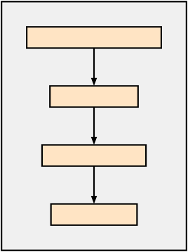
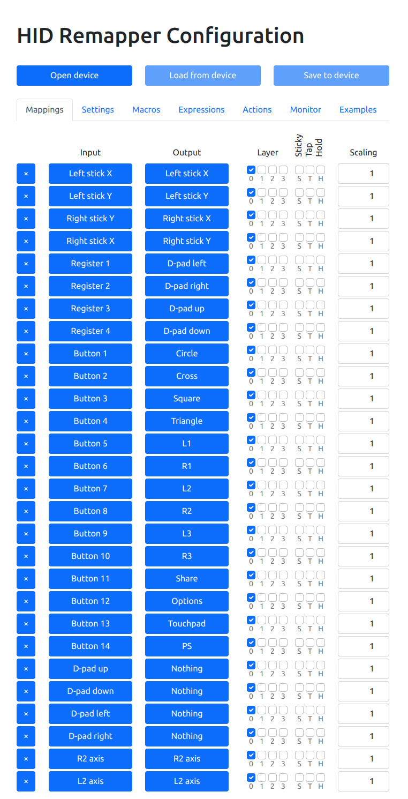
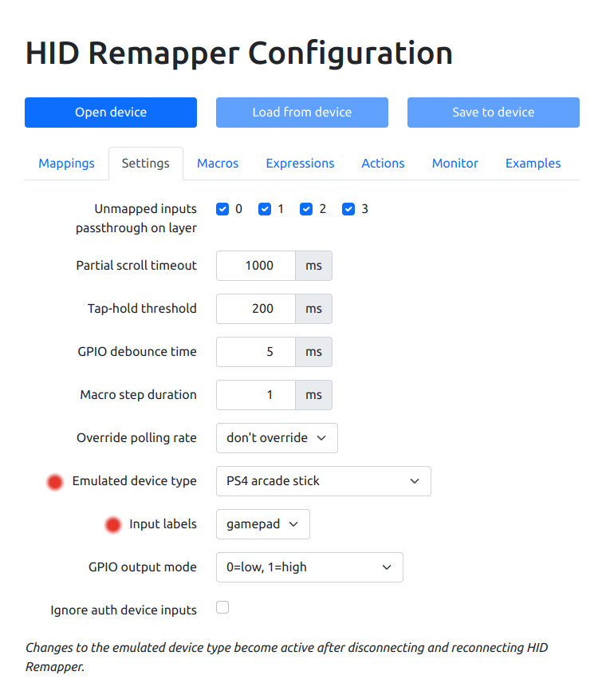
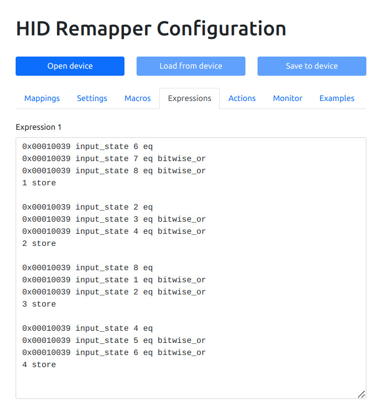
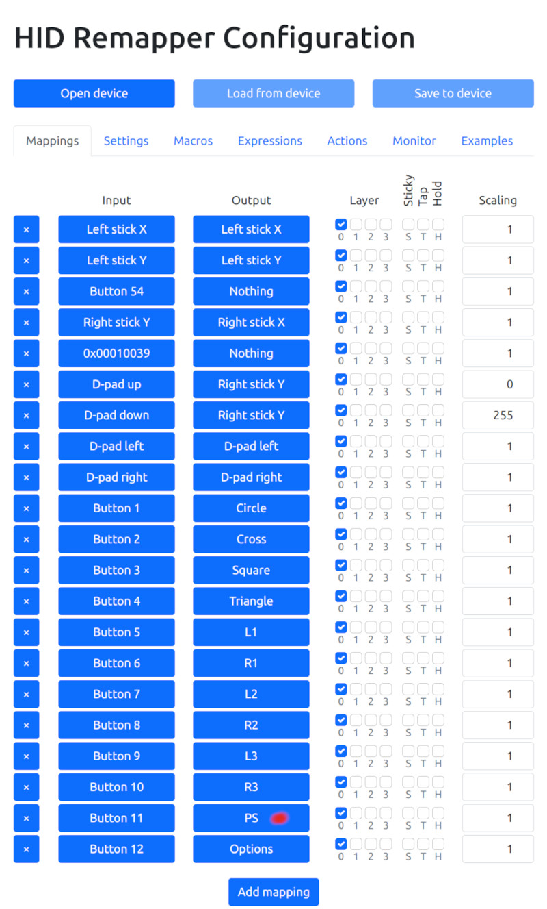
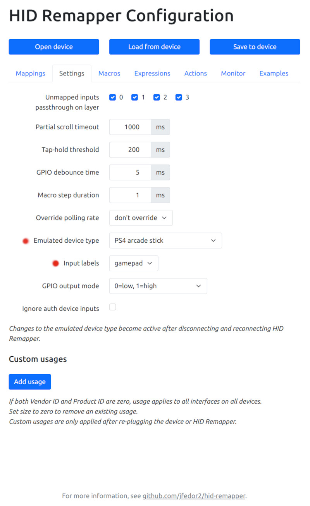

# How to connect a Logitech X52 joystick to a PS5

<kbd></kbd>

The Logitech X52 (and Extreme 3D Pro) works on PS5 using two adapters: Brook
Gaming Wingman FGC 2 and hid-remapper. The hid-remapper board converts the
joystick to look like a gamepad.  The FGC 2 adapter makes the hid-remapper
gamepad look like a DualSense gamepad.

Other joysticks may or may not work. The Thrustmaster T.16000 does not work
with the Feather board.

## Hardware

* Brook Gaming Wingman FGC 2
* Adafruit Feather RP2040 with USB Type A Host
* Snap-on Enclosure for Adafruit Feather RP2040 USB Host
* Various USB cables

## Software

https://github.com/jfedor2/hid-remapper

Scroll down past the list of files to see the instructions. Load the
hid-remapper firmware into the Feather board.

## Load the hid-remapper JSON file

The X52 configuration can be loaded from [this JSON file](./x522dsgamepad.json).
Using the JSON file is faster than setting the mappings one line at a time.

Plug the Feather board into the computer. Open Chrome to
[hid-remapper-config](https://www.jfedor.org/hid-remapper-config/).

In the configuration screen, use the "Open device" button to open the Feather
board. Click on Actions then "Import JSON". Specify the x522dsgamepad.json
file. Next click on the "Save to device" button.

Unplug the Feather board and plug it back in to make sure it is using the
latest configuration. Plug the joystick into the Feather board.

## Logitech/Saitek X52 Configuration

The X52 has more controls than a gamepad so only a subset can be mapped.
Mapping to a gamepad has the advantage of making the X52 usable in games
that do not support joysticks.

<kbd>)</kbd>

The big joystick X and Y axes control the gamepad left thumb stick axes. The
big joystick twist/yaw axis controls the gamepad right thumb stick X axis (look
left and right).

On the throttle, the top rotary dial controls the gamepad L2 axis. The side
rotary dial controls the R2 axis. The big throttle controls the gamepad right thumb stick Y axis
(look up/down).

Buttons and axes mapping can be changed using the web interface.

Be sure to map the PS button because PS5 requires this button to recognize the
controller. PS = PlayStation logo.

<kbd>)</kbd>

Set the "Emulated device type" to "PS4 arcade stick" and the "Input labels" to
"gamepad".

<kbd>)</kbd>

Every control is available. The large dpad on the stick requires special
handling but it works. See Expression 1 and Register 1 to 4 in the mapping tab.

## Logitech Extreme 3D Pro Configuration

The Logitech Extreme 3D Pro (LE3DP) also works but it has fewer controls. The
throttle slider does not work.

The LE3DP configuration can be loaded from [this JSON
file](./le3dp2dsgamepad.json).  Using the JSON file is faster than setting the
mappings one line at a time.

<kbd>)</kbd>

The big joystick X and Y axes control the gamepad left thumb stick axes. The
big joystick twist/yaw axis controls the gamepad right thumb stick X axis (look
left and right). The big joystick dpad up/down positions control the gamepad
right thumb stick Y axis (look up/down). Buttons can be mapped as needed for
the game.

Be sure to map the PS button because PS5 requires this button to recognize the
controller. PS = PlayStation logo.

The joystick throttle slider cannot be mapped. Button 54 is a bug so do not
use.

<kbd>)</kbd>

Set the "Emulated device type" to "PS4 arcade stick" and the "Input labels" to
"gamepad".
